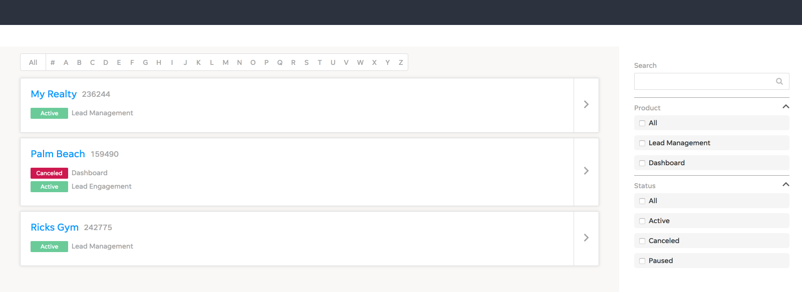

### Client List Assignment

Estimated effort: 6 hours

#### Description

The Client List application allows you to search our client list. 

#### What is being requested

* Create a list showing all clients as shown on mock.
* Parse the json data from `src/data.json` to retrieve client list.
* Show the client name, id, and list of products.
* Include an alphapicker bar on the top of the list.
* Include a search box on the right side.
* Include a Product & Status filter list.

#### Provided Styles

Some styles have already been provided for you.

* When the product has an *active* state use #69CB99
* When the product has a *canceled* state use #cd1950
* `icon-rl-forward` forward arrow.
* `icon-rl-chevron-down` down arrow used for collapsible filters.
* `icon-rl-chevron-up` up arrow used for collapsible filters.
* `icon-rl-search` search icon for search box.

#### Bonus points

* Make the alphapicker filter functional.
* Make the search box filter functional.
* Make the product & status filters collapsible.
* Make the product & status filters functional.
* ADA Compliant (ScreenReader, Keyboard navigation etc...)

#### Considerations

You may restructure the code as you see fit (while respecting the provided rules), creating new files and directories as needed.
The solution to the assignment can be sent back as a zip/tar.gz file.

Things to take into account while implementing your solution:

* You may use 3rd party libraries. We've included [bootstrap](https://www.npmjs.com/package/bootstrap), [node-sass](https://www.npmjs.com/package/node-sass), and [react-collapsible](https://www.npmjs.com/package/react-collapsible).
* Design & code style: code structure, solution design, extensibility, easy to read & maintain, error handling.
* Test coverage: some level of unit testing is expected.

#### Rules

* **\* DO NOT PUBLISH YOUR CODE ON GITHUB OR FORK THIS PROJECT** ( or any other public platform )
* Assignment should be handed over via a link to a cloud storage service  ( **Dropbox** / **Google Drive** / **WeTransfer** or something similar ).

## Available Scripts

In the project directory, you can run:

### `npm start`

Runs the app in the development mode. 
Open [http://localhost:3000](http://localhost:3000) to view it in the browser.

The page will reload if you make edits. 
You will also see any lint errors in the console.

### `npm test`

Launches the test runner in the interactive watch mode.
